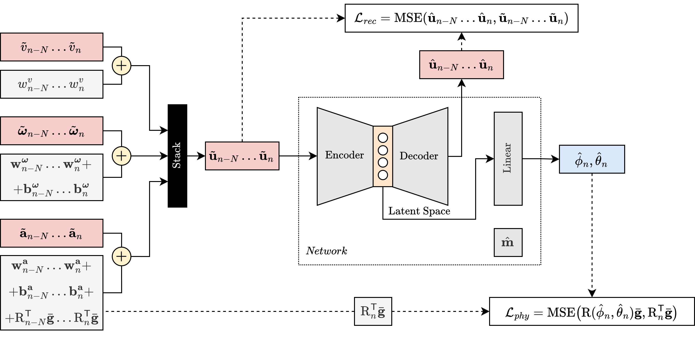

# Overview

This repository contains the code used for the paper [QuasittudeNet: A Self-Supervised Network for Attitude Estimation](). The paper proposes a self-supervised deep-learning model for estimating roll and pitch of land vehicles using onboard sensors. The proposed architecture is illustrated below:

<p align="center">
    
</p>

# Installation

The project was tested on `Ubuntu 20.04` and `Python 3.8.10`. Other used libraries can be found in the [requirements.txt](requirements.txt) file. After cloning the repository, you can create a custom environment using the following command:

```bash
python3 python3 -m venv env
```

The, proceed with the installation of the required libraries:

```bash
source env/bin/activate
pip3 install -r requirements.txt
```

# Data

After downloading the [ComplexUrban dataset](https://sites.google.com/view/complex-urban-dataset), please extract it into the [complexurban](data/complexurban/) folder so that the contents appear as follows:

<p align="center">
    
</p>

The file ``sets.json`` is provided with this repository.

# Code

Inside the [utils](utils/) folder you can find the codes for specific tasks. The [checkpoints](checkpoints/) folder contains the checkpoints for the proposed model. Finally, the [runs](runs/) folder contains Tensorboard checkpoints for analysis.

Detailed descriptions of the scripts, in order of their utilization, are provided below.

| Script | Description |
|:----------------:|---------------|
| [calibrate](utils/calibrate.py) | Used to compute the initial IMU misalignment using a portion of a trajectory where the vehicle is stationary. The acquired information is used inside the [main](main.py) script. |
| [dataset](utils/dataset.py) | Contains the PyTorch Dataset classes. |
| [network](utils/network.py) | Contains the proposed model implemented using PyTorch classes. |
| [main](main.py) | Used to train and test the model. By default, the test script saves the estimated outputs as CSV file used by the [plot](utils/plot.py) script.|
| [plot](utils/plot.py) | Used to compare the proposed model and the benchmark solutions. Run [main](main.py) script in test mode using the desired weights for each sequence available in the test set before comparing the results.|

# Citation
If you find this repository helpful, please consider citing:
<!-- ```bibtex

``` -->